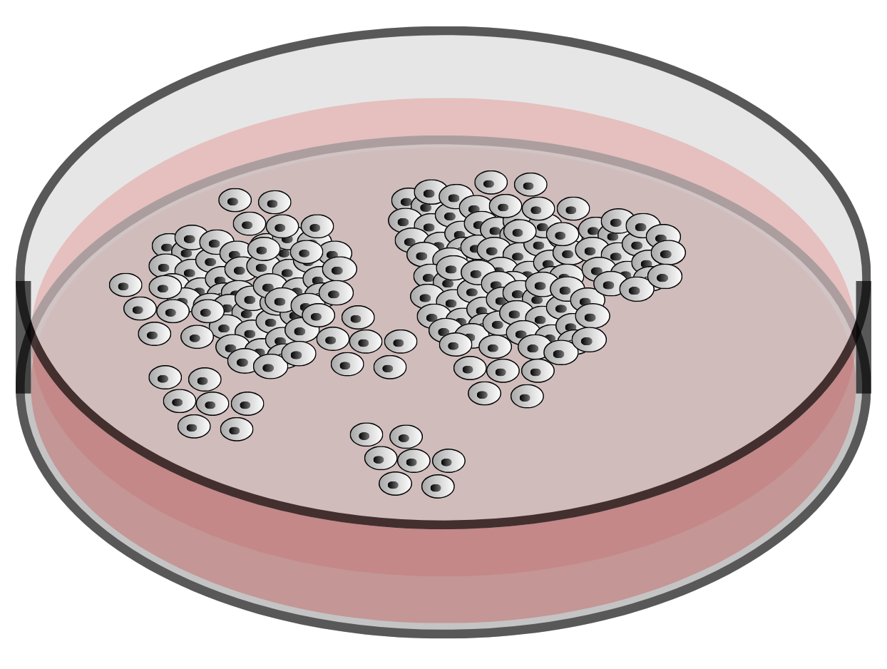
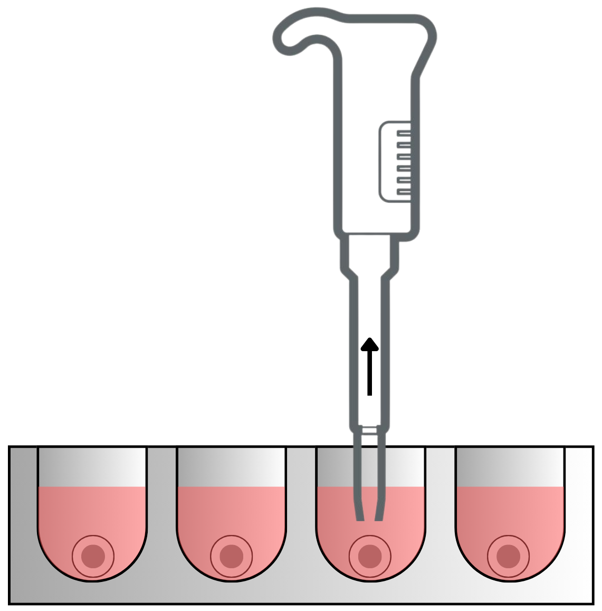
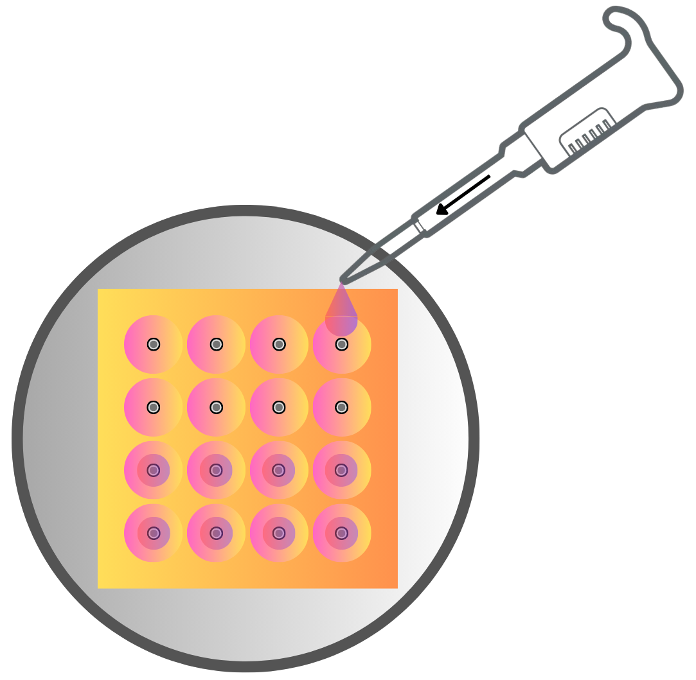
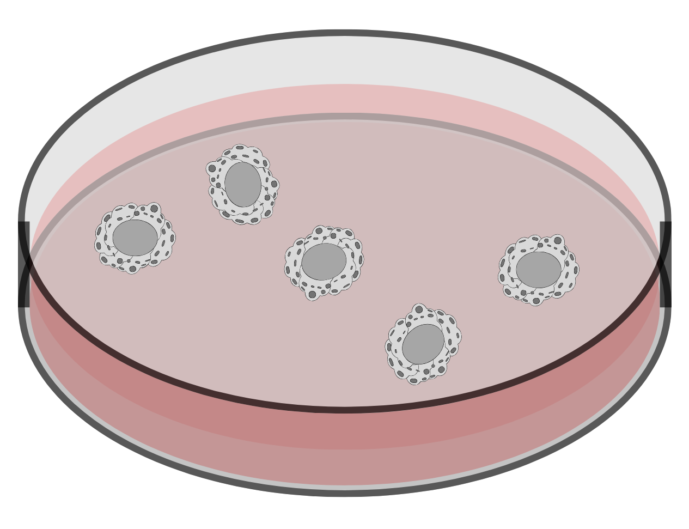
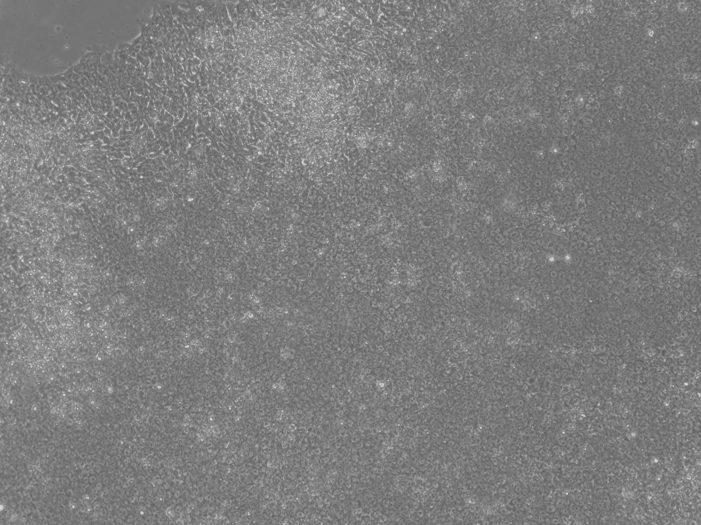
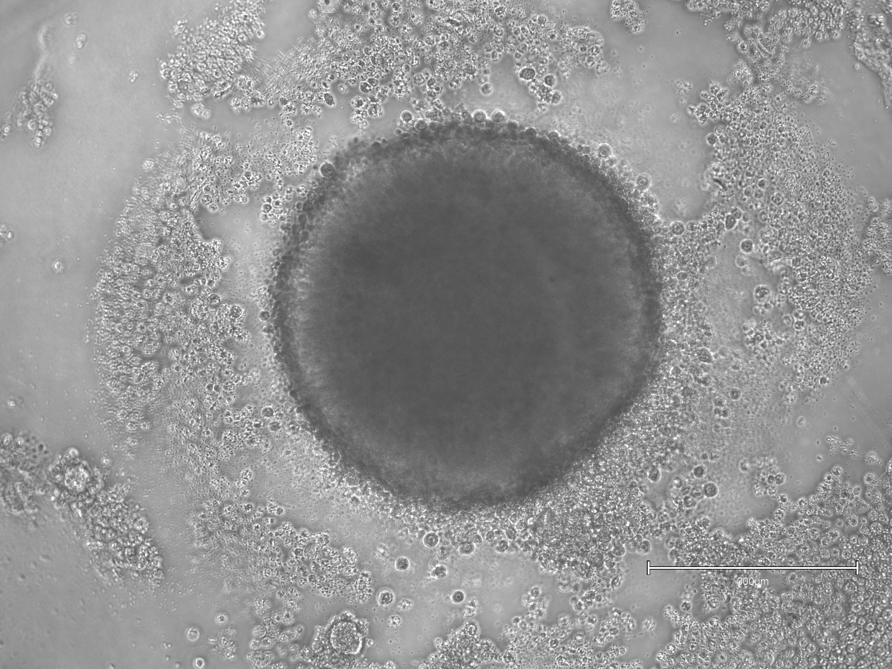
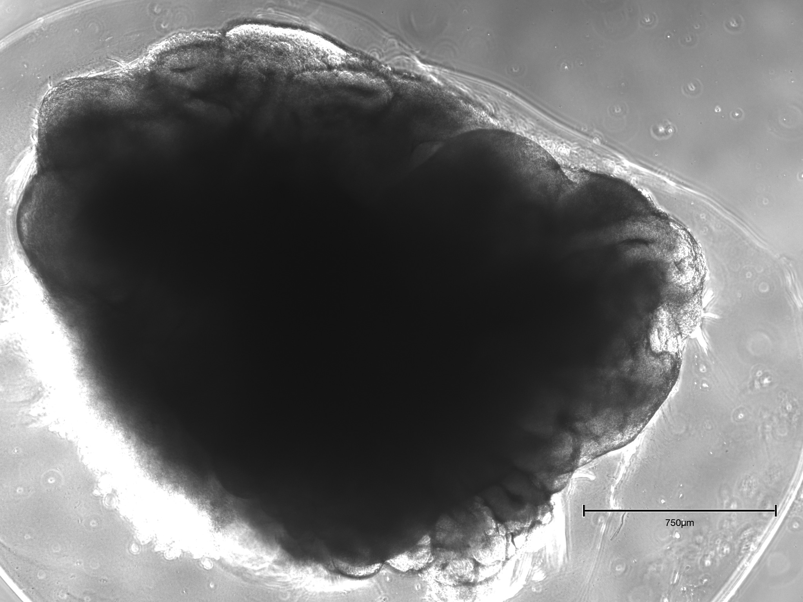
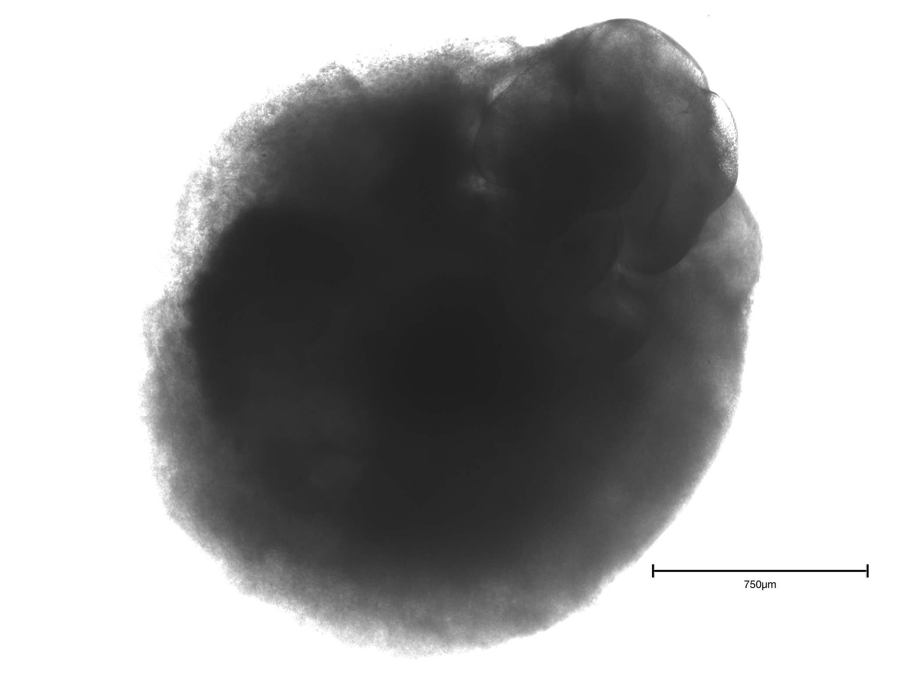
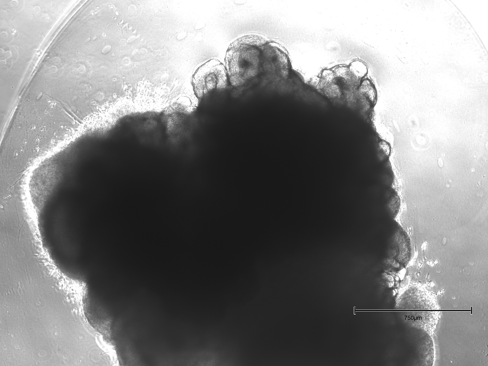
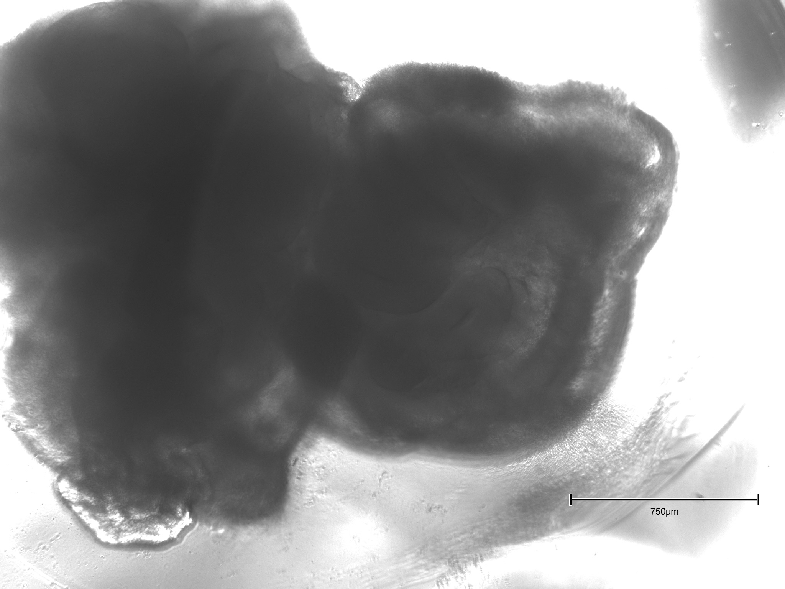

# Unguided Cerebral Organoid Protocol

Welcome to the open, detailed, and visual protocol for generating unguided cerebral organoids from iPSCs.

  

    <h3>💡 Quick Start</h3>
    
Step-by-step, image-rich protocol for reproducible results.

  

  

    <h3>📖 Appendix & Troubleshooting</h3>
    
Clear guidance for cell counting, seeding, and managing organoid fusion or sticking.

  

  

    <h3>🖼️ Gallery</h3>
    
Chronological images for every stage: EB, embedding, maturation.

  

!!! tip "Best Practice"
    For optimal results, follow sterile technique and monitor EB morphology at every stage.

---

# Protocol for Generating Unguided Cerebral Organoids

_With Illustrated Steps and Timeline_

**Author:**  
Evgenii Kachkin

**Affiliation:**  
Heidelberg University / ZMBH / Kaessmann Lab

**Version:**  
February 17, 2025

---

## Contents

1. [References](#references)
2. [Introduction](#introduction)
3. [Materials and Equipment](#materials-and-equipment)
   - 3.1 Cell Lines and Media
     - 3.1.1 Media Compositions
   - 3.2 Reagents
     - 3.2.1 Anti-apoptotic Inhibitors Compositions
   - 3.3 Plastics and Disposables
   - 3.4 Equipment
4. [Pre-Protocol Considerations](#pre-protocol-considerations)
5. [Detailed Protocol](#detailed-protocol)
   - 5.1 Timeline Overview
   - 5.2 Stage I: Cell Cultivation and Seeding (Day 0)
     - 5.2.1 Stem Cell Cultivation
     - 5.2.2 Dissociation of iPSCs
     - 5.2.3 Harvesting and Counting Cells
     - 5.2.4 Seeding into 96-Well Plate
     - 5.2.5 Media Change Technique (at 2 Days Post Seeding)
   - 5.3 Stage II: Embryoid Body Growth
   - 5.4 Stage III: Neuroinduction
   - 5.5 Stage IV: Embedding in Basement Membrane Matrix (Days 7–9)
     - 5.5.1 Post-Embedding Maintenance (Full-Volume Changes in a Dish)
   - 5.6 Stage V: Retinoic Acid Addition and Ventricle Formation (Days 13–15+)
A. [Appendix: Counting Cells in a Neubauer Chamber with Trypan Blue and Detailed Seeding Example](#appendix-a)
   - A.1 Preparing and Loading the Chamber
   - A.2 Microscopy and Counting
   - A.3 Cell Concentration and Viability Calculation
   - A.4 Detailed Example: Preparing for a 96-Well Plate
   - A.5 Final Notes and Tips
B. [Appendix: Preventing and Managing Sticking of Organoids](#appendix-b)
   - B.1 Preventive Measures
   - B.2 Managing Stuck or Fused Organoids
   - B.3 Additional Tips
C. [Image Gallery](#image-gallery)
   - C.1 Seeding for Embryoid Body Formation
   - C.2 Embryoid Body Formation
   - C.3 Embedded Organoid Development
   - C.4 Organoid Maturation
   - C.5 Plate 1: Early Embedding (8 dps) and Early Vitamin A Addition (14 dps)
   - C.6 Plate 2: Early Embedding (8 dps) and Early Vitamin A Addition (14 dps)
   - C.7 Plate 3: Late Embedding (9 dps) and Late Vitamin A Addition (15 dps)

---

## 1. References

Based on, with modifications:

1. JoVE (2023), DOI: 10.3791/65176.
2. Lancaster, M.A., Knoblich, J.A. Generation of Cerebral Organoids from Human Pluripotent Stem Cells. Nat Protoc. 9, 2329–2340 (2014).

---

## 2. Introduction

Cerebral organoids are three-dimensional multicellular structures derived from pluripotent stem cells that mimic brain-like regions. This protocol outlines the generation of “unguided” cerebral organoids from induced pluripotent stem cells (iPSCs), allowing spontaneous formation of dorsal forebrain–like areas. Applications include studying embryonic brain development, species-specific neurogenesis differences, and modeling neurodevelopmental disorders.

---

## 3. Materials and Equipment

### 3.1 Cell Lines and Media

- iPSC Lines: Human, chimpanzee, or rhesus monkey.
- iPSC Culture Media: mTeSR Plus (human/chimpanzee) or iPSC Brew (macaque).
- Neuroinduction Media (NIM): DMEM/F12 with supplements.
- Differentiation Media (DM): DMEM/F12 and Neurobasal with supplements, and with or without vitamin A (retinoic acid).

#### 3.1.1 Media Compositions

**Table 1: NIM (Neuroinduction Media) for 50 mL**

| Component                 | Amount   |
|---------------------------|----------|
| DMEM/F12                  | 48.5 mL  |
| N2 supplement             | 500 µL   |
| GlutaMax (100x stock)     | 500 µL   |
| MEM NEAA (100x stock)     | 500 µL   |
| Heparin (1 mg/mL stock)   | 50 µL    |

**Table 2: DM -A or +A (Differentiation Media without or with retinoic acid) for 50 mL**

| Component                 | Amount   |
|---------------------------|----------|
| DMEM/F12                  | 24 mL    |
| Neurobasal                | 25 mL    |
| B27 -A or +A              | 500 µL   |
| N2 supplement             | 250 µL   |
| MEM NEAA (100x stock)     | 250 µL   |
| GlutaMax (100x stock)     | 500 µL   |
| Pen-Strep (100 U/mL stock)| 500 µL   |
| 2-MeEtOH (1:100)          | 17.5 µL  |
| Insulin                   | 12.5 µL  |

### 3.2 Reagents

- DPBS (Dulbecco’s Phosphate-Buffered Saline)
- Accutase
- DMEM/F-12
- Pro-survival compound (PSC) or CET (mix of anti-apoptotic inhibitors) with Polyamine (CET+P)
- Basement membrane matrix (Matrigel)
- Retinoic acid (vitamin A)

#### 3.2.1 Anti-apoptotic Inhibitors Compositions

**Table 3: PSC Dilutions**

| Component | Dilution |
|-----------|----------|
| PSC       | 1:1000   |

**Table 4: CET+P (or CEPT) Dilutions**

| Component  | Dilution |
|------------|----------|
| CET        | 1:4000   |
| Polyamine  | 1:1000   |

### 3.3 Plastics and Disposables

- 96-well ultralow attachment plates
- 15 mL conical tubes, 60 mm Petri dishes
- Parafilm
- Sterile scissors, forceps, and pipette tips
- Neubauer chamber or automated cell counter

### 3.4 Equipment

- **Laminar Flow Hood:** For sterile work and UV sterilization.
- **Incubator:** 37°C, 5% CO₂, 95% humidity.
- **Centrifuge:** Capable of 300 ×g.
- **Orbital Shaker:** 65 rpm capacity.

---

## 4. Pre-Protocol Considerations

1. **iPSC Quality:** Ensure iPSCs exhibit minimal spontaneous differentiation and are mycoplasma-free.
2. **Passaging iPSCs:** Split cells to achieve approximately 80% confluency on the day of EB seeding.
3. **Sterile Technique:** Disinfect surfaces with 70–80% ethanol and maintain sterile conditions to prevent contamination.

---

## 5. Detailed Protocol

### 5.1 Timeline Overview

---

### 5.2 Stage I: Cell Cultivation and Seeding (Day 0)

#### 5.2.1 Stem Cell Cultivation

Maintain iPSCs in feeder-free conditions, ensuring high viability post-thaw. Allow cells to recover, proliferate, and reach 80% confluency before passaging. Use a splitting ratio of 1:6 to 1:15, depending on colony density and health. Restrict total passaging to three rounds after thawing to maintain genomic stability.

#### 5.2.2 Dissociation of iPSCs

1. When iPSCs reach 80–90% confluency, aspirate the medium.
2. Wash cells with DPBS.
3. Add 400 µL Accutase and incubate at 37°C for 5–7 minutes until cells fully detach.
4. Confirm detachment under a microscope, ensuring colonies lift as single cells.
5. Stop the reaction with 1 mL prewarmed DMEM/F12. For sensitive lines, supplement with an anti-apoptotic compound if needed.
6. Gently pipette up and down 5–10 times for a homogeneous single-cell suspension.

#### 5.2.3 Harvesting and Counting Cells

For details on cell counting with a Neubauer chamber, see [Appendix A](#appendix-a).

1. Transfer cell suspension to a 15 mL conical tube.
2. Centrifuge at 300 ×g for 5 minutes at room temperature.
3. Aspirate the supernatant; resuspend the pellet in 2 mL DMEM/F12 (with anti-apoptotic compound if required).
4. Count viable cells using a Neubauer chamber or automated cell counter.

#### 5.2.4 Seeding into 96-Well Plate

See [Appendix A](#appendix-a) for detailed seeding calculations.

1. Adjust cell density to 9,000 cells per 150 µL (60,000 cells/mL) in iPSC medium with anti-apoptotic compounds.
2. Dispense 150 µL per well into an ultralow attachment 96-well plate.
3. Important: Gently invert the tube before pipetting each row to prevent cell sedimentation. Add cells in a continuous, steady motion to avoid drop formation.
4. Incubate at 37°C, 5% CO₂, undisturbed for 48 hours.
5. At 2 dps (days post seeding), gently remove 100 µL medium from each well and replace with 150 µL fresh iPSC medium (without PSC).

#### 5.2.5 Media Change Technique (at 2 Days Post Seeding)

**Gently Remove Medium:**
- Tilt the 96-well plate so EBs collect on one side.
- Using a P200 pipette set to 100–150 µL, place the tip against the well wall above the EB at a 45° angle.
- Aspirate 100 µL of old medium without disturbing the EB or well surface.

**Add Fresh Medium:**
- Slowly dispense 150 µL fresh medium (no PSC) down the well wall at an angle, minimizing turbulence and keeping the EB in place.

---

### 5.3 Stage II: Embryoid Body Growth

1. **Medium Changes Every Other Day:**
   - After initial 48 h, perform medium changes every other day.
   - Gently remove 150 µL spent medium using a P200 pipette, minimizing EB disturbance. Adjust for evaporation as needed.
   - Replenish with 150 µL fresh, prewarmed iPSC medium (without anti-apoptotic compounds), dispensing along the well wall.

2. **Morphology and Growth by 4–5 dps:**
   - By days 4–5, EBs should be smooth, spherical, and translucent at the edges (typical diameter 150–300 µm, line-dependent).
   - Inspect for contamination daily; discard compromised wells to protect healthy cultures.

---

### 5.4 Stage III: Neuroinduction

1. **Switch to Neuroinduction Medium (NIM):**
   - For macaque EBs: switch on day 4 dps.
   - For human/chimpanzee EBs: switch on day 5 dps.
   - Replace iPSC medium with 150 µL fresh NIM per well.

2. **Continue NIM Changes Every Other Day:**
   - Remove and replace 150 µL NIM every other day, taking care not to aspirate or damage EBs.

---

### 5.5 Stage IV: Embedding in Basement Membrane Matrix (Days 7–9)

1. **Timing:**  
   - Rhesus macaque: embed at 7 dps; human/chimpanzee: at 8–9 dps.

2. **Preparation:**  
   - Sterilize tools monthly; thaw Matrigel on ice for 30–60 min.
   - Prepare Parafilm with 4×4 dimples for embedding (see protocol for details).

3. **Transfer EBs:**  
   - Use wide-bore tips to gently transfer EBs into individual Matrigel droplets in Parafilm dimples. Remove excess medium without drying EBs.

4. **Add Matrigel:**  
   - Overlay each EB with cold Matrigel. Ensure full coverage for 3D support.

5. **Polymerization:**  
   - Incubate at 37°C for 15–30 min to polymerize Matrigel.

6. **Detach to Shaker Culture:**  
   - Invert Parafilm with embedded EBs into a dish of DM (no vitamin A). Gently swirl to release droplets, then incubate at 37°C on a shaker (65 rpm).

|  |  |
|:--------------------------------------:|:--------------------------------------:|
| **Figure 4a.** EBs during transfer     | **Figure 4b.** EBs during embedding    |

---

#### 5.5.1 Post-Embedding Maintenance (Full-Volume Changes in a Dish)

- **Media Change (No Vitamin A):**  
  - Every other day, replace the full volume (5–6 mL) of differentiation medium (DM, no vitamin A) in the organoid culture dish.

- **Centring Organoids:**  
  - Before aspirating, gently swirl the dish to gather organoids in the center.

- **Medium Exchange:**  
  - Use a 1,000 µL pipette to carefully aspirate medium from the edge, avoiding the organoid cluster.

- **Refilling:**  
  - Slowly add 5–6 mL fresh DM down the side of the dish, then swirl gently.

- **Routine Inspection:**  
  - Monitor for necrosis, fusion, or sticking. If organoids stick together, separate gently with a wide-bore tip.

---

### 5.6 Stage V: Retinoic Acid Addition and Ventricle Formation (Days 13–15+)

1. **Switch to Vitamin A DM:**  
   - On day 13 (rhesus) or 14–15 (human/chimpanzee), replace all medium with DM containing vitamin A (retinoic acid). Continue using gentle exchange technique.

2. **Feeding Frequency:**  
   - After the first vitamin A addition, replace the full medium volume every 3–4 days (or every 2–3 days for rapidly growing organoids).

3. **Expected Morphology:**  
   - Within 1–2 weeks, neuroepithelial rosettes and ventricle-like cavities should emerge. Monitor for organoid fusion or size heterogeneity.

---

**Final Remarks:**  
This optimized protocol provides comprehensive, stepwise instructions for the robust generation of unguided cerebral organoids. Success depends on strict aseptic technique, careful monitoring of EB and organoid morphology, and consistent medium preparation. Adjust timelines and interventions as needed for specific iPSC lines or experimental goals. Regular sterility checks and Matrigel quality assessment are recommended to maximize reproducibility and developmental fidelity.

---

## Appendix A: Counting Cells in a Neubauer Chamber with Trypan Blue and Detailed Seeding Example

Accurate cell counting is essential for reproducible organoid formation. This section outlines how to prepare your sample for counting in a Neubauer (hemocytometer) chamber, how to factor in trypan blue for viability assessment, and how to calculate the volume needed for a 96-well plate when each well should receive 9,000 cells.

### A.1 Preparing and Loading the Chamber

1. **Sample Preparation:**
   - Gently resuspend your cell pellet in an appropriate medium (e.g., DMEM/F12 + PSC) to ensure a homogeneous cell suspension.
   - If the cell density is very high, pre-dilute the suspension (e.g., 1:2 or 1:10) to avoid overcrowding on the chamber grid.
   - **Trypan Blue Staining:** To assess viability, mix 10 µL of your cell suspension with 10 µL of trypan blue (1:1).
     - This introduces a 2-fold dilution factor to be accounted for in the final calculation.
     - Non-viable cells will appear dark or deep blue; viable cells remain unstained or faintly stained.

2. **Loading the Chamber:**
   - Clean the hemocytometer with 70% ethanol and place a coverslip over the counting grid.
   - Using a pipette, carefully load 10 µL of your (stained) cell suspension on the edge of the coverslip. Capillary action should pull the fluid under the coverslip, covering the grid.
   - Avoid introducing bubbles or overfilling the chamber; if you see fluid run into the outer channels, discard and reload.

---

### A.2 Microscopy and Counting

1. **Focus and Identify the Grid Lines:**
   - Place the hemocytometer on the microscope stage.
   - Under low magnification, focus on the central counting area. Each Neubauer chamber has 9 large squares.

2. **Count Cells in Four Corner Squares:**
   - Typically, you count the cells in four corner squares (each corner is subdivided into 16 smaller squares).
   - Include cells touching the top or left boundary lines; exclude cells on the bottom or right boundary lines to avoid double counting.
   - If cells are too densely packed, prepare a further dilution.

3. **(Optional) Calculate Viability by Using Trypan Blue:**
   - Record how many cells are stained vs. unstained to determine the viability percentage:  
     **Viability (%) = Number of unstained (viable) cells / Total cells × 100**

---

### A.3 Cell Concentration and Viability Calculation

1. **Average Cell Count:**
   - Suppose you count cells in four large squares: 45, 50, 48, and 52.
   - Average = (45 + 50 + 48 + 52) / 4 = 48.75 cells per large square.

2. **Convert to Cells/mL:**
   - In a Neubauer chamber, multiply by 10⁴ to obtain cells/mL:  
     48.75 × 10⁴ = 4.875 × 10⁵ cells/mL.

3. **Account for Trypan Blue Dilution:**
   - If you mixed the cell suspension with trypan blue at 1:1, that is a 2-fold total dilution.
   - Multiply the above result by 2:  
     4.875 × 10⁵ × 2 = 9.75 × 10⁵ cells/mL.
   - This is your final cell concentration.

---

### A.4 Detailed Example: Preparing for a 96-Well Plate

**Goal:** Seed 9,000 cells per well in 150 µL for each of 96 wells.

1. **Determine the Target Cell Density for Seeding:**
   - Each well requires 9,000 cells in 0.15 mL (150µL):  
     Target density = 9,000 cells / 0.15 mL = 60,000 cells/mL.

2. **Compare Your Final Measured Concentration to the Target:**
   - From the calculation above, your suspension is at 9.75 × 10⁵ cells/mL.
   - You need 6.0 × 10⁴ cells/mL for seeding.
   - The required dilution factor is:  
     9.75 × 10⁵ / 6.0 × 10⁴ ≈ 16.25.

   - In other words, you must dilute your cell suspension 16.25-fold to reach 60,000 cells/mL.

3. **Calculate the Final Volume Needed:**
   - If you currently have 1 mL of the concentrated suspension at 9.75 × 10⁵ cells/mL, to dilute it 16.25-fold, you need a total of:  
     16.25 mL − 1 mL = 15.25 mL of additional medium (with PSC if desired).
   - This gives you 16.25 mL at 6.0 × 10⁴ cells/mL once mixed thoroughly.

4. **Seeding a 96-Well Plate:**
   - Total volume needed for a 96-well plate:  
     96 × 0.15 mL = 14.4 mL.
   - You will have 16.25 mL total, which is enough for all 96 wells plus extra for pipetting errors.
   - Aliquot 150 µL into each well; each well now contains 9,000 cells.

---

### A.5 Final Notes and Tips

- **Check Viability:** If using trypan blue, ensure an acceptable percentage of viable (unstained) cells prior to seeding.
- **Mix Gently and Often:** Cells can settle quickly. Gently swirl or invert the tube before each pipetting step to keep the suspension homogeneous.
- **Add a Margin:** Preparing slightly more than the minimum needed for 96 wells (e.g., enough for 100 wells) helps avoid running short due to pipetting loss.

---

## Appendix B: Preventing and Managing Sticking of Organoids

Organoids may sometimes stick to each other or adhere to the dish walls. Below are practical tips for prevention and remediation:

### B.1 Preventive Measures

1. **Optimize Seeding Density:**
   - Avoid over-seeding dishes such that large numbers of organoids end up in close proximity.
   - Excessively high density promotes fusion and sticking.
   - To prevent overcrowding, sticking and ensure adequate nutrient supply, limit cultivation to a maximum of 16 organoids per 60 mm Petri dish.

2. **Proper Embedding:**
   - Press Gently: Use moderate force when pressing Parafilm over the tip rack. Excessive indentation can result in lumps or ridges.
   - Check for Bumps: Inspect dimples for an even, shallow shape to ensure a smooth Matrigel droplet later on.
   - Irregular Matrigel surfaces can trap organoids in ridges or corners, raising the risk of sticking and making it harder to properly embed each organoid.
   - Allowing Matrigel to polymerize for longer than 30 minutes during embedding can reduce the overall adhesivity around organoids.
   - Conversely, prematurely transferring organoids after a very short solidification period (e.g., <15 minutes) may leave the Matrigel too soft, increasing the risk of fusion or sticking.

3. **Gentle Orbital Shaking:**
   - Keep organoids in constant, slow motion (e.g., 65 rpm) to reduce the likelihood of them settling and sticking to each other or the surface.
   - Confirm that the shaker is level and the speed is correct; too slow may allow settling, while too fast can induce shear stress.

4. **Regular Medium Changes:**
   - Replace medium on schedule (every 2–3 days, depending on the protocol stage) to remove debris and cell clumps that can promote sticking.
   - During medium changes, swirl the dish gently before aspiration so that organoids gather away from the edges.

5. **Use of Wide-Bore Pipette Tips:**
   - When transferring organoids, always use cut or wide-bore tips to reduce mechanical damage that creates sticky debris.
   - Slow pipetting helps avoid pushing organoids together.

---

### B.2 Managing Stuck or Fused Organoids

1. **Separation:**
   - Initial Swirl: Gently swirl or tilt the dish to see if the organoids will naturally separate from each other or from the dish surface.
   - Aspirate and Dispense: If they remain fused, use a pipette (preferably with a wide-bore or cut tip) to aspirate and dispense medium directly onto the fusion point.
   - Use Minimal Force: Apply gentle pressure to avoid creating a high-flow jet that could damage the organoids.

2. **Lower the Culture Density:**
   - If fusion is frequent, reduce the total number of organoids per dish or well.
   - Splitting a heavily populated plate into two plates can alleviate crowding.

---

### B.3 Additional Tips

1. **Frequent Monitoring:**
   - Check the cultures daily, at least briefly, to catch early signs of sticking or fusion.
   - Early intervention (e.g., gently separating partially fused organoids) is less damaging than dealing with a large fused cluster.

2. **Record Keeping:**
   - Maintain detailed notes of any sticking or fusion events, and any corrective actions taken.
   - This log helps troubleshoot future occurrences by revealing patterns or batch-specific issues.

**Final Note:**  
Implementing these preventive measures and gentle mechanical interventions early usually resolves mild sticking or fusion.

---

## Image Gallery

This gallery showcases representative phase-contrast images captured during the generation of cerebral organoids using the stepwise protocol above. Figures are organized chronologically to illustrate key technical stages, culture morphology, and decision points throughout organoid production.

---

### C.1 Seeding for Embryoid Body Formation

---

### C.2 Embryoid Body Formation

- (a) Formation and early compaction of embryoid bodies (EBs) within 96-well ultralow attachment plates.
- (b) Spherical symmetry and viability during initial days post seeding.

|  |  |
|:------------------------------------------:|:-----------------------------------------:|
| **Day 2 post-seeding:** EBs form compact, uniform spheroids. Typical diameter: 100–200 μm. No visible necrotic core. | **Day 3 post-seeding:** EBs expand further, edges remain regular. Continued compaction and smooth contour. |

|  |  |
|:--------------------------------------------------:|:-------------------------------------------------:|
| **Day 5 post-seeding:** EBs after media switch to Neuroinduction Medium (NIM). Neuroepithelial thickening and further growth. | **Day 6 post-seeding:** Onset of visible neuroepithelial border; EBs remain discrete and healthy with no clumping. |

---

### C.3 Embedded Organoid Development

- (a) Early embedding in Matrigel after 8 days in suspension culture, before transfer to rotary shaker.
- (b) Late embedding at 9 days, illustrating minor differences in outer structure and Matrigel encapsulation.

|  |  |
|:---------------------------------------------------------------------:|:--------------------------------------------------------------------:|
| **Early embedding (8 dps):** EB immediately after Matrigel encapsulation, showing robust neuroepithelial surface. | **Late embedding (9 dps):** EB transferred to Matrigel after extended pre-embedding culture, with a denser surface zone and some variability in contour. |

---

### C.4 Organoid Maturation

- (a) Forebrain organoid 11 days post-seeding, following early embedding.
- (b) Forebrain organoid 11 days post-seeding, following late embedding.

|  |  |
|:--------------------------------------------------------------:|:-------------------------------------------------------------------:|
| **11 dps, early-embedded:** Mature neuroepithelial rosettes and emerging ventricle-like cavities. Organoid remains spherical with smooth outer surface. | **11 dps, late-embedded:** Similar size and organization, with subtle differences in outer margin and radial organization of cells. |

---

### C.5 Plate 1: Early Embedding (8 dps) and Early Vitamin A Addition (14 dps)

- (a) and (b) show different organoids from Plate 1, both subjected to early embedding and vitamin A addition at day 14.

|  |  |
|:-----------------------------:|:-----------------------------:|
| **p1-3.1:** Example of well-formed forebrain organoid after 26 days in culture, following optimal timeline. Features include dense neuroepithelium and distinct luminal space. | **p1-5.2:** Representative organoid from same plate, demonstrating consistency of morphology across technical replicates. |

---

### C.6 Plate 2: Early Embedding (8 dps) and Early Vitamin A Addition (14 dps)

- (a) and (b) show additional organoids from Plate 2 with identical protocol parameters.

|  |  |
|:-----------------------------:|:-----------------------------:|
| **p2-3.1:** Organoid illustrating homogeneous radial neuroepithelial zones after 26 days, corresponding to early embedding/early vitamin A. | **p2-4.2:** Slight variation in outer thickness, but robust neuroepithelial stratification, confirming reproducibility of the optimized protocol. |

---

### C.7 Plate 3: Late Embedding (9 dps) and Late Vitamin A Addition (15 dps)

- (a) and (b) display organoids subjected to late embedding and delayed vitamin A addition.

|  |  |
|:-----------------------------:|:-----------------------------:|
| **p3-2.2:** Organoid after 26 days with delayed embedding and retinoic acid exposure, showing slightly enlarged and irregular neuroepithelial zones. | **p3-3.2:** Example of morphological heterogeneity sometimes observed with late embedding, including uneven border and less defined central lumen. |